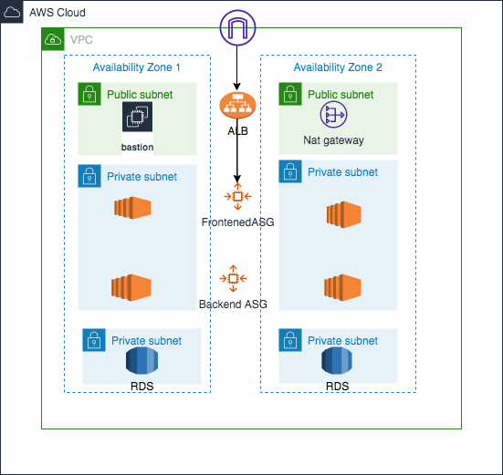

# ​​Three-Tier Architecture Deployment on AWS with Terraform

A three-tier architecture consisting of a Web tier, Application tier and a Database tier in private subnets with Autoscaling for the web and application tier and a load balancer. A Bastion Host and Nat gatway provisioned to allow ssh access to the instances and access to the internet. 

Terraform modules were used to make the process easily repeatable and reusable.  
This deployment will create a scalable, secure and highly available infrastructure that separates the different layers ensuring they are all communicating with each other. The architecture includes an Amazon Virtual Private Cloud (VPC), Elastic Load Balancer (ELB), Auto Scaling Group (ASG), and a Relational Database(RDS).
- The Web tier will have a bastion host and NAT gateway provisioned in the public subnets. The bastion host will serve as our access point to the underlying infrastructure. The NAT Gateway will allow our private subnets to communicate with the internet  while maintaining a level of security by hiding the private instances' private IP addresses from the public internet.
- In the Application tier, we will create an internet facing load balancer to direct internet traffic to an autoscaling group in the private subnets, along with a backend autoscaling group for our backend application. We will create a script to install the apache webserver in the frontend, and a script to install Node.js in the backend.
- In the Database tier, we will have another layer of private subnets hosting a MySQL database which will  eventually be accessed using Node.js..
 

 
 
I have provided a step-by-step guide to deploying this architecture on Amazon Web Services (AWS) using Terraform.

 
## Prerequisites
 
Before you begin, ensure that you have the following prerequisites:
 
1. AWS account credentials (access key ID and secret access key).
2. Terraform installed on your local machine. You can download Terraform from the official website: https://www.terraform.io/downloads.html.
3. Basic knowledge of AWS services such as EC2, VPC, ELB, ASG, and RDS.
4. Familiarity with the basics of Terraform, including how to write Terraform configuration files (`.tf`).
 
## Steps
 
Follow these step-by-step instructions to deploy a three-tier architecture on AWS using Terraform:
 
### Step 1: Clone the Repository
 
1. Open a terminal or command prompt on your local machine.
2. Clone the repository containing the Terraform configuration files:
   ```
   git clone https://github.com/3tierweb.git
   ```
3. Change into the project directory:
   ```
   cd your-repo-directory
   ```
 
### Step 2: Configure AWS Credentials
 
1. Open the AWS Management Console in your web browser.
2. Navigate to the **IAM** service.
3. Create a new IAM user or use an existing one.
4. Assign the necessary permissions to the IAM user, such as `AmazonEC2FullAccess`, `AmazonRDSFullAccess`, `AmazonVPCFullAccess`, and `ElasticLoadBalancingFullAccess`.
5. Generate an access key ID and secret access key for the IAM user.
6. Configure the AWS CLI with the IAM user credentials using the following command:
   ```
   aws configure
   ```
   Enter the access key ID and secret access key when prompted, and optionally set the default region.

### Step 3: Configure S3 bucket for state file storage
1. Sign in to your AWS account.
2. Open the Amazon S3 service.
3. Click "Create Bucket" and configure basic settings like name and region.
4. Optionally, enable features like versioning, logging, and encryption.
5. Review settings and click "Create bucket."

### Step 4: Configure Terraform Variables
 
1. Open the project directory in a text editor.
2. Locate the Terraform configuration file named `terraform.tfvars”. 
3. Modify the values of the variables according to your requirements.
   - `dbuser`: Set the username for the database.
   - `dbpassword`: Set the password for the database.
   - `db_name`: Set the name of the database.
Do not forget to gitignore your .tfvars file 
 
### Step 5: Initialize Terraform
 
1. In the terminal or command prompt, navigate to the project directory., cd to the root directory ‘terraform’
2. Run the following command to fix any syntax issue
    ```
    terraform fmt
    ```
3. Run the following command to initialize Terraform and download the required providers:
   ```
   terraform init
   ```
 
### Step 6: Review and Validate the Configuration
 
1. Run the following command to review the changes that Terraform will make:
   ```
   terraform plan
   ```
   Review the output to ensure that the planned infrastructure matches your expectations.
 
### Step 7: Deploy the Infrastructure
 
1. Run the following command to deploy the infrastructure:
   ```
   terraform apply
   ```
   Terraform will show you a summary of the changes that will be made. Type `yes` to confirm and start the deployment.
 
2. Wait for Terraform to provision the infrastructure. This process may take several minutes.
 
### Step 8: Access the Application
 
1. After the deployment is complete, Terraform will output the DNS name of the ELB.
2. Copy the DNS name and paste it into your web browser.
3. If everything is set up correctly, you should see the application running.
 
### Step 9: Destroy the Infrastructure (Optional)
 
If you want to tear down the infrastructure and remove all resources created by Terraform, you can follow these steps:
 
1. In the terminal or command prompt, navigate to the project directory.
2. Run the following command to destroy the infrastructure:
   ```
   terraform destroy
   ```
   Type `yes` to confirm the destruction.

### Step 10: Confirm Infrastructure
If you go into your AWS console, you should be able to see the VPC and subnets, internet gateway, route tables and associations, EC2 instances running in the proper locations, load balancers, and RDS database.


If we copy the load balancer endpoint we got from our Terraform output, and place it in the search bar, we will see the message we specified in our script for the Apache webserver.
If we refresh the page, we should see the IP address from the other instance in our frontend autoscaling group.


## Conclusion
We have successfully deployed a three-tier architecture on AWS using Terraform. This architecture provides a scalable and highly available infrastructure for your applications. 

The primary objectives are to ensure that the architecture complies with the following additional key
requirements:
Key Requirements:
## 1. Multi-tier architecture comprising front-end, backend, and database layers.
This architecture comprising front-end, backend and RDS layers in different subnets and 2 different AZ located in one vpc 10.0.0.0/24

## 2. Connectivity with a shared services VPC having 10.0.0.0/24 CIDR
All components are in different subnets and 2 different AZ located in one vpc 10.0.0.0/24
public subnet 10.0.0.0/27 and 10.0.0.32/27
10.0.0.0/27  az1 possible frontend and possible LB
10.0.0.32/27  az2  possible frontend and possible LB

private subnet 10.0.0.64/27 and 10.0.0.96/27
10.0.0.64/27  az1 backend and possible frontend
10.0.0.96/27  az2 backend and possible frontend

frontend we could put in the public subnet which may have public IP or public access.  From security perspective, we can also put them in the private subnet as long as the frontend LB is in the public subnet.

private DB subnet 10.0.0.128/27 and 10.0.0.160/27
leave it for RDS and multi-az rds


## 3. The web application must be highly available to ensure uninterrupted service delivery even during infrastructure failures.

web application has a frontend LB enabled, check the screenshot. The LB is associated with the launch template and ASG

## 4. The infrastructure should be able to handle sudden spikes in traffic without any degradation in performance.
The web LB is associated with the launch template and ASG, which can be dynamically scaled out or in depending on the workload and traffic.


## 5. Design robust security measures to safeguard sensitive data and protect against potential cyber threats.
frontend we could put in the public subnet which may have public IP or public access.  From security perspective, we can also put them in the private subnet as long as the frontend LB is in the public subnet.
All public access ports are open only to 22 and port 80 on the LB
All outgoing traffic or egress traffic has been done through NAT gateway for private subnets and DB subnets.
ssh-key is in place.
SG is in place 


## 6. Design a comprehensive cross region disaster recovery plan [4 hours of RTO and 30 min of RPO] to mitigate the impact of unforeseen disasters on the application.

2 vpc can be peered to cross-region or vpn/direct connect to ensure the network. or we can use global load balancer (aws global accelerator) to route the traffic. 
for web tier we can setup cross-region failover to india region from us-east-1. dns failover (health check or weighted dns) with route 53 can be leveraged. Also elastic load balancer can be setup for both primary and secondary region. 
Application tier, a regional load balancer can be helpful or be paireed with the global load balancer for cross-region-routing
for database tier,  use the multip-region database solution (for aws rds/aurora)to have the DR  and automated failover between region.
cross-region data replication can be done. DB Backup also can be implemented regularly in both regions, ensuring point-in-time recovery (PITR) with backup stored across regions
The last for s3 bucket/EFS we also can use cross-region replication or aws datasync to replicate efs to another region.

## 7. Secure remote access to servers for troubleshooting/administration.

remote ssh access to the bastion is enabled and tested. It can be used as the jumpbox to access internally.

## 8. Design required monitoring and loggings components for the migrated web application.

AWS cloudwatch can be added to the terraform (presently it's not implemented). to actively mornitor the Metrics for EC2, ELB, RDS, ASG etc.
Amazon cloudtrail, vpc flow logs and aws WAF/Shield logs can be leveraged to log all components and services. 

## 9. Ensure that app server logs are centrally aggregated.

We can use amazon cloudwatch logs to log all components logs to a dedicated aws account (under security OU)
Also we can send logs to a log dedicated s3 via cloudwatch

